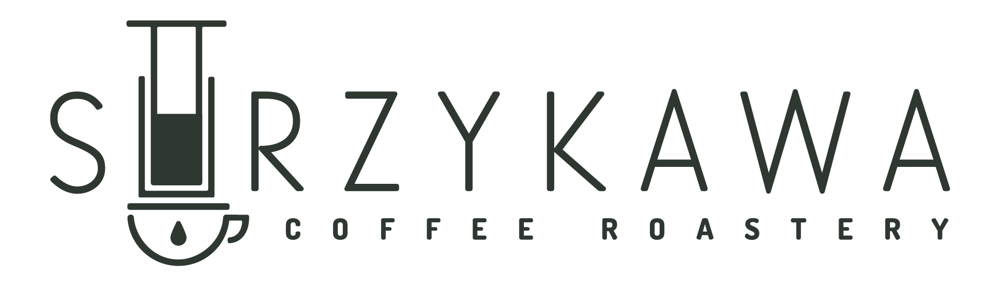

# ☕ Strzykawa - Coffee Shop & Roastery

<p align="center">
  
</p>

<p align="center">
  <strong>Nowoczesna strona e-commerce dla kawiarni i palarni kawy specialty w Częstochowie</strong>
</p>

<p align="center">
  <a href="https://strzykawa.netlify.app">🌐 Live</a> &nbsp;·&nbsp;
  <a href="https://www.instagram.com/strzykawa_coffee_shop">📸 Instagram</a> &nbsp;·&nbsp;
  <a href="https://www.facebook.com/StrzykawaCoffeeShop">📘 Facebook</a>
</p>

---

## 📋 O Projekcie

Strzykawa to pełnoprawny sklep internetowy z integracją **Shopify Storefront API**, prezentujący kawy specialty z całego świata. Projekt łączy minimalistyczny design z pełną funkcjonalnością e-commerce.

### Kluczowe cechy

- 🛒 **E-commerce** — pełna integracja z Shopify (produkty, koszyk, checkout, zamówienia)
- 🔐 **Konta klientów** — rejestracja, logowanie, profil, historia zamówień
- 🎨 **Design System** — spójny, minimalistyczny design (sharp corners + pastylki)
- 📱 **Mobile-first** — responsywny design z dedykowaną dolną nawigacją
- ⚡ **Performance** — Vite + React z code-splitting i lazy loading
- 🎬 **Rich Media** — video hero, galerie produktów, animowana oś czasu
- 🍪 **GDPR** — cookie consent, polityka prywatności, regulamin
- 📦 **InPost** — integracja z paczkomatami w formularzu checkout

---

## 🚀 Quick Start

### Wymagania

- Node.js 18+
- npm
- Konto Shopify z Storefront API

### Instalacja

```bash
git clone <repo-url>
cd strzykawa-site
npm install
```

### Zmienne środowiskowe

Projekt używa plików `.env.development` i `.env.production` (w repo).
Dla lokalnych nadpisań stwórz `.env.local` (gitignored):

```env
VITE_SHOPIFY_DOMAIN=twoj-sklep.myshopify.com
VITE_SHOPIFY_STOREFRONT_TOKEN=twoj-token
VITE_COMING_SOON=false
```

### Uruchomienie

```bash
npm run dev        # Dev server → http://localhost:5173
npm run build      # Production build → dist/
npm run preview    # Podgląd production build
npm run lint       # ESLint
npm run format     # Prettier
```

---

## 🛠 Tech Stack

| Kategoria | Technologia |
|-----------|------------|
| **Framework** | React 18 + Vite 7 |
| **Routing** | React Router v6 |
| **Styling** | Tailwind CSS 3 |
| **State** | Zustand (cart, auth, checkout) |
| **Icons** | React Icons |
| **E-commerce** | Shopify Storefront API (GraphQL) |
| **Hosting** | Netlify (auto-deploy z GitHub) |

---

## 📁 Struktura Projektu

```
src/
├── assets/              # Obrazy, video, logo
├── components/
│   ├── atoms/           # Button, Chip, Logo, Spinner, QuantitySelector...
│   ├── molecules/       # FilterSection, ProductGallery, VariantSelector...
│   ├── organisms/       # CoffeeGrid, FilterDrawer, CoffeeFilterBar...
│   ├── layout/          # Header, Footer, PageLayout, ModalWrapper...
│   ├── features/        # hero/, about/, contact/ (sekcje stron)
│   ├── coffee/          # CoffeeCard, CoffeeOverlay, ParametrSelector...
│   ├── cart/            # CartModal, CartItem, ShippingProgress...
│   ├── checkout/        # AddressForm, InPostWidget, DeliveryMethodSelector...
│   ├── header/          # DesktopNav, MobileNav, MobileBottomNavigation...
│   ├── modals/          # LoginModal, RegisterModal, QuickAddModal
│   └── profile/         # ChangePasswordForm, EditAddressForm
├── pages/               # 16 stron (Home, Coffees, CoffeeDetail, About...)
├── services/shopify/    # GraphQL client, product queries, cart, customer API
├── store/               # Zustand: cartStore, authStore, checkoutStore
├── hooks/               # useScrollAnimation, useHeroAnimation, useScrollZoom...
├── constants/           # navigation, layout, colors, shipping, timings, preview
├── utils/               # logger (dev-only console wrapper)
└── App.jsx              # Routing, Coming Soon mode, preview mode
```

---

## ✅ Zaimplementowane funkcje

### E-commerce
- Katalog produktów z Shopify (GraphQL) z filtrami (palenie, kraj, obróbka)
- Dynamiczne warianty (250g/1kg, ziarna/mielona) z dostępnością
- Koszyk z Shopify Cart API (add/remove/update, persystencja)
- Quick Add Modal — szybkie dodawanie z gridu produktów
- Formularz checkout z wyborem dostawy (kurier/paczkomat InPost)
- Pasek postępu darmowej wysyłki (próg: 250 zł)
- Redirect do Shopify Checkout

### Konta klientów
- Rejestracja i logowanie (Shopify Customer API)
- Profil użytkownika z edycją adresu
- Zmiana hasła i odzyskiwanie hasła
- Historia zamówień z detalami
- Walidacja tokenu i auto-logout

### UI/UX
- Video hero (desktop + mobile)
- Mobilna dolna nawigacja z animacjami
- Auto-hide header przy scrollu
- Cart bounce animation po dodaniu produktu
- Animowana oś czasu na stronie O nas
- Cookie consent z GDPR compliance
- Coming Soon mode z preview (tajny link)
- Style Guide (/style-guide) — showcase design systemu

### Strony
- Strona główna z hero i featured coffees
- Katalog kaw z filtrami i wyszukiwaniem
- Strona produktu ze szczegółami i galerią
- O nas — historia z animowaną osią czasu
- Kontakt — mapa, dane kontaktowe
- B2B — formularz współpracy
- Strony prawne (regulamin, prywatność, cookies, dostawa)
- 404 Not Found

---

## 🎨 Design System

Pełna dokumentacja: [`DESIGN_SYSTEM.md`](./DESIGN_SYSTEM.md)

| Element | Styl |
|---------|------|
| **Buttony** | `rounded-full` (pastylki) |
| **Badges count** | `rounded-full` + `bg-success` (zielone) |
| **Karty/Modale** | Sharp corners (brak zaokrągleń) |
| **Info boxes** | `rounded-lg` |
| **Font** | Dosis (400, 500, 700) |

### Paleta kolorów

| Kolor | Hex | Użycie |
|-------|-----|--------|
| Primary | `#1E2A25` | Tło strony |
| Accent | `#6B7F73` | Linki, secondary buttons |
| Success | `#0E8C6F` | Badges, success states |
| CTA | `#3A5F55` | Przyciski checkout |
| Muted | `#9CA8A1` | Tekst pomocniczy |

---

## 🔧 Konfiguracja

### Coming Soon Mode

Kontrolowane przez zmienną `VITE_COMING_SOON`:
- `false` w `.env.development` — pełna strona
- `true` w `.env.production` — strona Coming Soon

### Preview Mode

Tajny dostęp do pełnej strony mimo Coming Soon:
```
https://strzykawa.netlify.app/?preview=strzykawa2025
```
Hasło zapisuje się w localStorage. Zmiana w `src/constants/preview.js`.

### Darmowa wysyłka

Próg w `src/constants/shipping.js`:
```javascript
FREE_SHIPPING_THRESHOLD = 250  // PLN
SHIPPING_COST = 11.99          // PLN
```

---

## 📖 Dokumentacja

| Plik | Opis |
|------|------|
| [`DESIGN_SYSTEM.md`](./DESIGN_SYSTEM.md) | Zasady designu, kolory, komponenty |
| [`CLAUDE.md`](./CLAUDE.md) | Przewodnik dla AI assistantów |

---

## 🤝 Contributing

Projekt prywatny — development by [@enowuigrek](https://github.com/enowuigrek)

---

## 📞 Kontakt

**Strzykawa Coffee Shop & Roastery**
📍 ul. Dąbrowskiego 4, 42-200 Częstochowa
📧 kontakt@strzykawa.com
☎️ +48 668 011 806

**Social Media:**
[Facebook](https://www.facebook.com/StrzykawaCoffeeShop) · [Instagram](https://www.instagram.com/strzykawa_coffee_shop)

---

## 📄 License

© 2025 Strzykawa. All rights reserved.

**Projekt i wykonanie:** [lukasznowak.dev](https://lukasznowak.dev)
