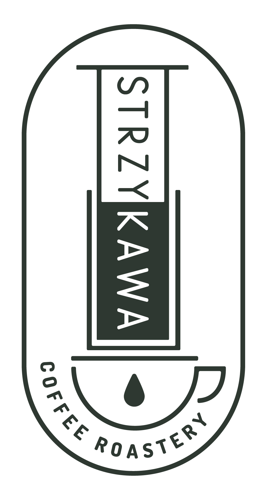

  

  
  
  
  
  

# Strzykawa

**A headless Shopify website built for a real commercial specialty coffee business.**

Strzykawa is a production web project built as a **custom headless frontend connected to Shopify**, created for a local specialty coffee shop to present the brand and enable product browsing.

Shopify is used as the backend (products / content), while the frontend is fully custom-built in React.

This is a real commercial project delivered for a paying client.

---

## 🚀 Status & Demo

**Status:** Live (production)  
**Demo:** https://strzykawa.com

---

## ✨ Core Features

- Headless Shopify integration
- Custom React storefront frontend
- Clean landing page layout
- Responsive design for all screen sizes
- Fast loading static content
- Focused UI for clarity and simplicity

---

## 🛠 Tech Stack

- React
- Vite
- SCSS
- Shopify (Headless)

---

## 🎯 Project Highlights

- Production headless commerce architecture
- Real client delivery
- Custom frontend + Shopify backend
- Local business digital presence
- Designed for simplicity and performance

---

## 👤 Author

Built by Łukasz Nowak  
GitHub: https://github.com/enowuigrek

---

## 📄 License

Commercial project – source shared for portfolio purposes only
